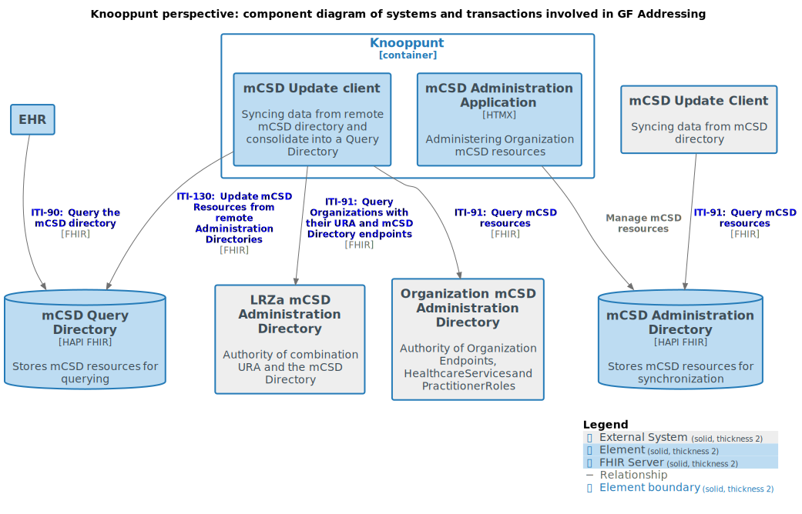
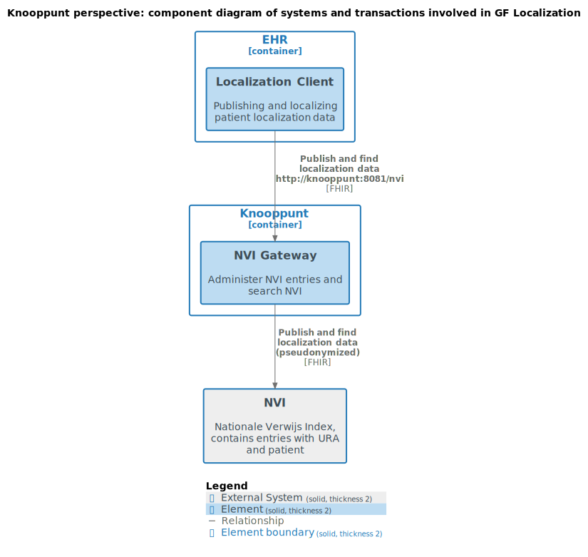
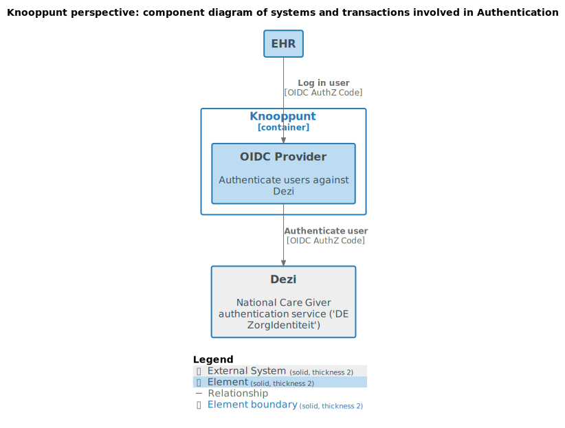
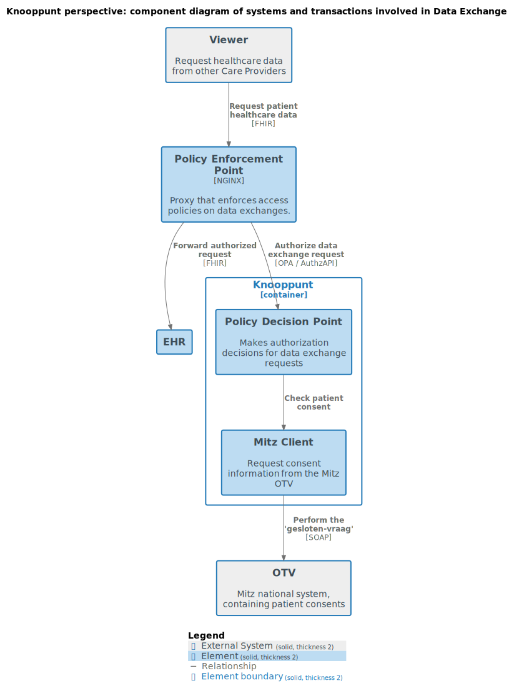

# Architecture
This document details the inner design of the Knooppunt.

## Addressing

## Localization

## Authentication

## Handling inbound data requests

External data requests are authenticated and authorized by the Knooppunt.

### Nuts Reference Solution Architecture

We follow the [Nuts Reference Solution Architecture](https://wiki.nuts.nl/books/ssibac/page/referentie-solution-architectuur-wip) for handling inbound data requests:

The Knooppunt acts as Authorization Server ("AS") and Policy Decision Point ("PXP").

### Implementation

