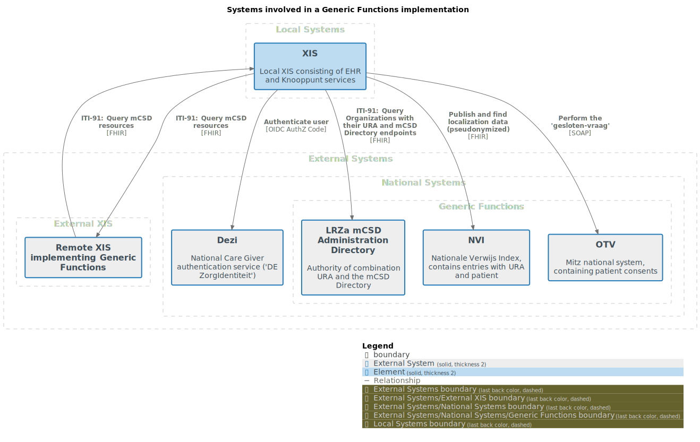
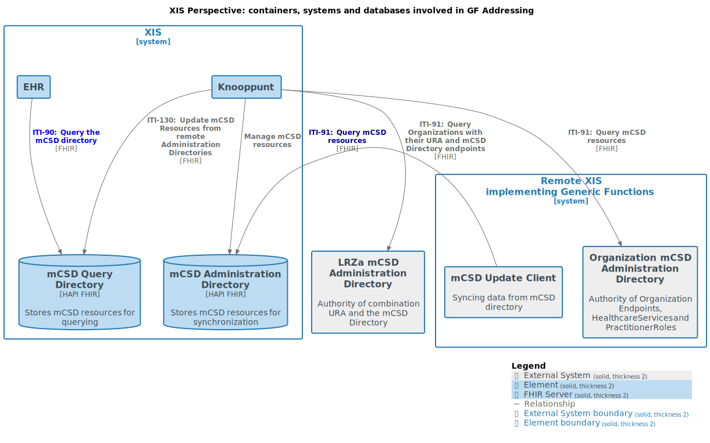
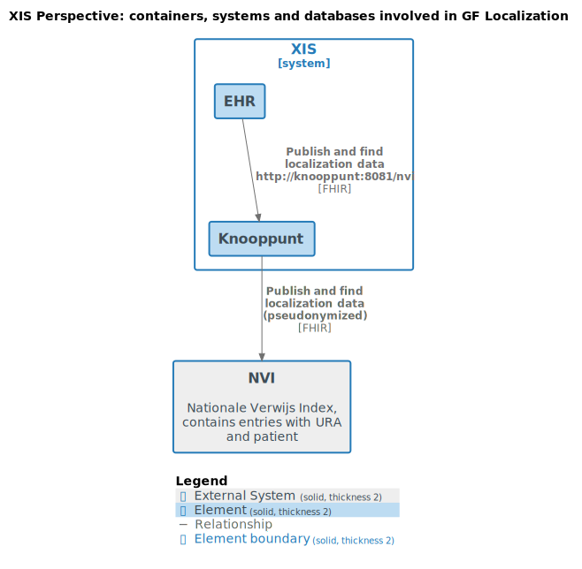
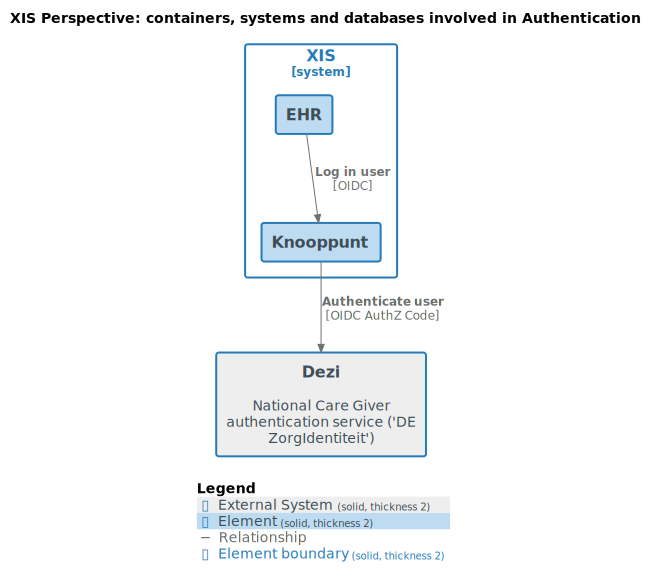
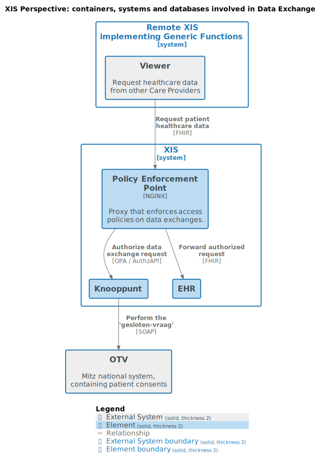

# Deployment

This page describes how to deploy the Knooppunt.

The diagrams on this page were created using [Structurizr](https://structurizr.com/), files are generated using `generate.sh`.

## Overview



### GF Addressing


### GF Localization


### Authentication


### Handling inbound data requests


### Technology

The Knooppunt is provided as a Docker image: `docker pull ghcr.io/nuts-foundation/nuts-knooppunt:0.1.2`
(see the [repository](https://github.com/nuts-foundation/nuts-knooppunt/pkgs/container/nuts-knooppunt)) for the latest version.

Refer to the Nuts node documentation for details on how to set up and configure the embedded Nuts node.

The Knooppunt requires a FHIR server for the mCSD Directories, you can use HAPI FHIR server for this.

## Generic Functions

This chapter describes when/how to deploy specific generic functions of the Knooppunt.

See [CONFIGURATION.md](./CONFIGURATION.md) for detailed configuration options.

### Addressing

To participate in the addressing generic function Knooppunt will connect to several FHIR APIs to synchronize data, according to the mCSD profile:
- a Root Administration Directory, authoritative on care organizations and their Administration Directory endpoints,
- Administration Directories of care organizations, discovered through the Root Administration Directory.
- a local Query Directory where the synchronisation process will put data received from other organisations

For your own Knooppunt, you need to:
- provide a FHIR API for the Query Directory
- provide a FHIR API for the Administration Directory, containing your care organization registrations, that other Knooppunt instances can query.
    - You can use the embedded mCSD Admin Editor web application (`/mcsdadmin`) to maintain this directory.
- configure the Root Administration Directory

A multi tenant HAPI server can be used for hosting both the admin and query directory. We recommend to keep this data
separate, but you can choose to combine the data in a single tenant if so desired.

#### Using the mCSD Administration Application

The Knooppunt contains a web-application to manually manage the mCSD Administration Directory entries (e.g. create organizations and endpoints).
This web-application uses the mCSD Administration Directory FHIR API to create/update/delete these resources.

Set [`mcsdadmin.fhirbaseurl`](./CONFIGURATION.md) to the FHIR base URL of the mCSD Administration Directory to use the embedded mCSD Admin (web-)Application.

> **_NOTE:_**
> Alternatively, the vendor can choose to manage the mCSD Administration Directory outside the Knooppunt,
> for example through an existing care organization/endpoint database or API.
>
> Examples when a vendor doesn't manage the mCSD Administration Directory through the embedded mCSD Admin (web-)Application include:
> - the vendor manages its mCSD information directly in a database (e.g. an SQL database)
> - the vendor syncs its mCSD information from another system (e.g. an ERP system) to the mCSD Administration Directory

### Localization

To enable the NVI-endpoint of the Knooppunt, you need to provide a base URL for the NVI service, as provided by the ministry of health (VWS).

Set [`nvi.baseurl`](./CONFIGURATION.md) to the base URL of the NVI service.

> **_NOTE:_** During preliminary testing, an example NVI is available on this URL:
>    ```
>    https://knooppunt-test.nuts-services.nl/nvi
>    ```

### Inbound data requests

To handle inbound data requests, you need to deploy a Policy Enforcement Point (PEP) in front of the Knooppunt.
This is typically a reverse proxy that performs authentication and authorization of incoming requests.

An example PEP using NGINX [can be found here](../pep).

### Authentication

You can use the OIDC Provider in the Knooppunt for user authentication, which abstracts intricacies of Dezi.

Otherwise, you need to directly integrate with Dezi yourself.

#### Nuts node
The Knooppunt can be deployed with an embedded Nuts node. If a vendor has an existing Nuts node,
or wants to have the Nuts node deployed separately, the Knooppunt can use that Nuts node instead.

Use [`nuts.enabled`](./CONFIGURATION.md) to configure the embedded or existing Nuts node.

### Tracing

The Knooppunt supports distributed tracing using OpenTelemetry. Traces can be sent to any OTLP-compatible collector (e.g. Jaeger, Grafana Tempo, or a vendor's existing observability platform).

To enable tracing, set [`tracing.otlpendpoint`](./CONFIGURATION.md) to the address of your OTLP collector.

Span names are formatted as `METHOD /path` (e.g. `POST /mcsd/update`). The component can be identified from the path prefix (`/mcsd/*`, `/nvi/*`, `/pdp/*`) and filtered using the `http.target` tag.

See [CONFIGURATION.md](./CONFIGURATION.md) for all tracing options.
