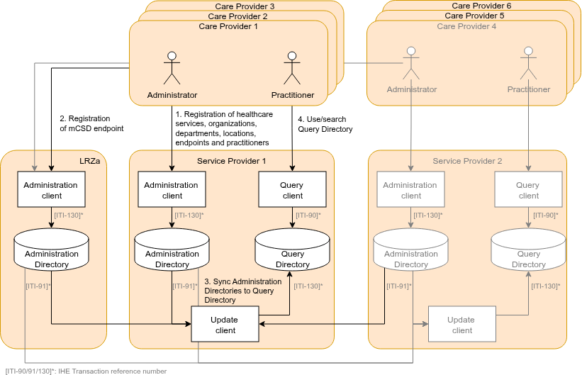
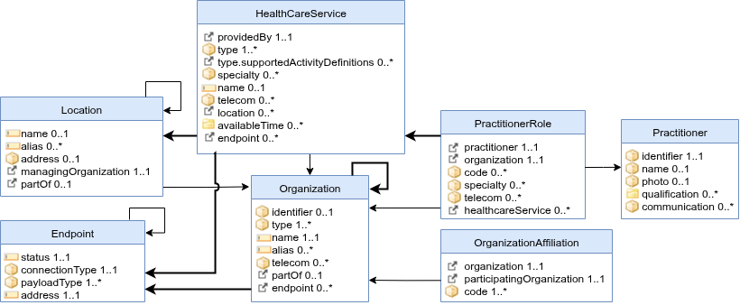

# Care Services Directory - Netherlands - Generic Functions for data exchange Implementation Guide v0.3.0
Netherlands - Generic Functions for data exchange Implementation Guide, published by Stichting Nuts. This guide is not an authorized publication; it is the continuous build for version 0.3.0 built by the FHIR (HL7® FHIR® Standard) CI Build. This version is based on the current content of [https://github.com/nuts-foundation/nl-generic-functions-ig/](https://github.com/nuts-foundation/nl-generic-functions-ig/) and changes regularly. See the [Directory of published versions](http://nuts-foundation.github.io/nl-generic-functions-ig/history.html)

*   [Introduction](#introduction)
*   [Solution overview](#solution-overview)
*   [Components (actors)](#components-actors)
*   [Data models](#data-models)
*   [Security](#security)
*   [Example use cases](#example-use-cases)
*   [Roadmap for Care Services](#roadmap-for-care-services)

### Introduction

This FHIR Implementation Guide specifies the technical components of the Generic Function Addressing (GFA), a national initiative led by the Dutch Ministry of Health, Welfare and Sport (VWS). GFA aims to establish a standardized, interoperable system for discovering and sharing current (digital) addresses of healthcare providers, enabling reliable and efficient exchange of health data across healthcare systems and organizations.

This guide outlines the technical requirements and architectural principles underlying GFA, with a focus on trust, authenticity, and data integrity. Key design principles include:

*   International standards: The solution should be based on international standards, lowering the bar for international (European) data exchange and adoption by internationally operating software vendors.
*   Single Source of Truth: Each address record originates from one definitive and authoritative source.
*   Stakeholder Responsibility: Healthcare providers are accountable for maintaining the accuracy of address data in their source systems.

By adhering to these principles, this Implementation Guide supports consistent and secure address discovery, fostering improved interoperability within the healthcare ecosystem.

### Solution overview

GFA follows the IHE [mCSD profile](https://profiles.ihe.net/ITI/mCSD/index.html) ([GF-Adressering, ADR-0](https://github.com/minvws/generiekefuncties-adressering/issues/166)). The [mCSD profile](https://profiles.ihe.net/ITI/mCSD/index.html) provides multiple options for deployment. This guide specifies the choices made for The Netherlands. Most impactful/striking choice are:

*   using a combination of 'NL-core' and 'IHE mCSD' for the FHIR-profiles in this IG.
*   using the Landelijke Register Zorgaanbieders (LRZa) as the source/master-list of all other sources.

Unlike in the IHE mCSD specification,

Here is a brief overview of the processes that are involved:

1.  Every care provider registers its addressable entities in an 'Administration Directory'. This IG distinguishes the actor ['**_Administration_** Directory'](#administration-directory) and the ['**_Query_** Directory'](#query-directory); in the IHE mCSD specification, these are both called a 'Directory'.
2.  Every care provider registers the endpoint (URL) of its 'Administration Directory' at the LRZa registry (also an 'Administration Directory').
3.  An 'Update Client' uses the LRZa ([GF-Adressering, ADR-7](https://github.com/minvws/generiekefuncties-adressering/issues/155)) and the care provider Administration Directories to consolidate all data into a 'Query Directory.'
4.  A practitioner and/or system (EHR) can now use the Query Directory to search for resources defined within mCSD (for example: a practitioner searching for a healthcare service or a system searching for a specific endpoint)



This overview implies a decentralized architecture for many components. An important central component is the LRZa Administration Directory. For more detail on the topology of GF Adressing, see [GF-Adressering, ADR-5](https://github.com/minvws/generiekefuncties-adressering/issues/153).  
Each component, data model, and transaction will be discussed in more detail.

### Components (actors)

#### Administration Client

The Administration Client is responsible for managing the registration and maintenance of addressable entities within a healthcare organization. It should be able to create, update, and delete records for healthcare services, organizations, departments, locations, endpoints, or practitioners in the Administration Directory. Addressable entities MUST conform to the [Data models](#data-models).

The Administration Client of the LRZa provides a user interface for healthcare providers to administer their Administration Directory endpoint (URL).([GF-Adressering, ADR-10](https://github.com/minvws/generiekefuncties-adressering/issues/159) and [GF-Adressering, ADR#167](https://github.com/minvws/generiekefuncties-adressering/issues/167))

#### Administration Directory

The Administration Directory persist all addressable entities of one or more healthcare organizations. The Administration Directory MAY implement [these capabilities](./CapabilityStatement-nl-gf-admin-directory-admin-client.html) for an Administration Client to create, update and delete resources. If you've implemented both an Administration Client & Directory, you can also choose to use proprietary formats/APIs/transactions between these components.

The Administration Directory MUST implement [these capabilities](./CapabilityStatement-nl-gf-admin-directory-update-client.html) to publish changes of addressable entities. These changes are consumed by an [Update Client](#update-client).

The performance/availability/data-quality requirements for an Administration Directory ([GF-Adressering, ADR#177](https://github.com/minvws/generiekefuncties-adressering/issues/177)):

*   **Query Response Time:** 95% of \_history requests should be answered within 2000ms.
*   **Availability:** Minimum uptime of 99% between 8PM and 6AM (Europe/Amsterdam timezone).
*   **Data quality:** Resources should conform to the profiles under [Data models](#data-models), including valid references between reference (i.e. referential integrity)

#### Update Client

The Update Client is responsible for aggregating and synchronizing addressable entity data from multiple Administration Directories. It periodically retrieves updates, including new, modified, or deleted records, and consolidates this information into a Query Directory.

The Update Client uses a [FHIR 'history-type' operation](http://hl7.org/fhir/R4/http.html#history) and (optionally) parameter `_since` to get updates from Administration Directories, for example:

```
GET https://somecareprovider.nl/fhirR4/Organization/_history?_since=2025-02-07T13:28:17.239+02:00&_format=application/fhir+json

```


Besides using the 'history-type' operation, the Update Client should be able to query all instances in the Administration Directory using a search operation. Either for the initial load or periodically for a full reload to fix edge-case scenario's (e.g. Administration Directory backup restores). ([GF-Adressering, ADR-14](https://github.com/minvws/generiekefuncties-adressering/issues/163))

During consolidation, multiple Administration Directories may have overlapping or conflicting entities. An Update Client MUST only use data from authoritative data sources ([GF-Adressering, ADR#186](https://github.com/minvws/generiekefuncties-adressering/issues/186)) and MUST obey these guidelines:

*   The LRZa Administration Directory is authoritative for Organization instances with `identifier` of system `http://fhir.nl/fhir/NamingSystem/ura` (URA) and its `name`. When the healthcare provider's Administration Directory also provides a `name` value (for an Organization-instance with a URA-identifier), these values should be ignored. Other elements from the healthcare provider's Administration Directory should be added. This way, a healthcare provider can add an `alias` or `endpoint` using it's own Administration Directory.
*   The LRZa Administration Directory contains a list of Organization resources (identified by a URA) and Endpoint resources referencing the Administration Directory endpoint (URL). An Administration Directory is only authoritative for the healthcare providers that registered this Administration Directory endpoint (URL) at the LRZa. Information about other healthcare providers MUST be disregarded. For example, if the LRZa Administration Directory has 20.000 Organization-records, of which 2 Organizations (identified by 'URA-1' and 'URA-2') use the same Administration Directory endpoint ('https://admindirectory.example.com/'). This Endpoint MAY contain other resources (e.g. Organization/Location/HealthcareService-records), not authored by URA-1 and URA-2. These other resources MUST be disregarded by update clients as this Administration Directory is not the authoritative source.
*   All HealthcareServices, Locations, PractitionerRoles and Organization-entities of a single healthcare provider MUST (indirectly) link to a top-level Organization-instance with a URA-identifier:
    *   All HealthcareService, Location, PractitionerRole entities MUST be directly linked to an Organization-instance (could be 'sub-Organization' like a department).
    *   All Organization-instances MUST either link to a parent-Organization or have a URA-identifier (being a top-level Organization instance)
    *   All Endpoint-instances MUST be linked to from one of the HealthcareService or Organization-instances.

After consolidation, the Update Client writes the updates to a Query Directory. The Update Client MAY use the same interactions a Administration Client uses to register entities in an Administration Directory.

#### Query Directory

The Query Directory persist all addressable entities it receives from the Update Client. The Query Directory MAY implement [these capabilities](./CapabilityStatement-nl-gf-admin-directory-admin-client.html) for an Update Client to create, update and delete resources. If you've implemented both an Update Client & Query Directory, you can also choose to use proprietary formats/APIs/transactions between these components. Due to the consolidation process of the Update Client, not all (intermediate) changes are replicated between Administration Directories and Query Directory

The Query Directory serves/exposes all addressable entities to one or more Query Clients. The Query Directory MAY implement [these capabilities](./CapabilityStatement-nl-gf-query-directory-query-client.html) for a Query Client to search and read resources. If you've implemented both an Query Client & Query Directory, you can also choose to use proprietary formats/APIs/transactions between these components.

#### Query Client

The Query Client is used to search and retrieve information from the Query Directory, which contains consolidated data from all Administration Directories. It enables practitioners, EHR systems, and other healthcare applications to discover healthcare services, organizations, departments, locations, endpoints, or practitioners across the entire ecosystem. By querying the Query Directory, users can efficiently find up-to-date and authoritative addressable entities for care coordination, referrals, and electronic data exchange.

### Data models

Within GF Addressing, profiles are used to validate data. They are based on both mCSD-profiles and nl-core-profiles (TODO: use Nictiz nl-core package as soon as dependency-bug is fixed)([GF-Adressering, ADR#188](https://github.com/minvws/generiekefuncties-adressering/issues/188)). Ideally, these profiles are merged in the nl-core-profiles in the future. An overview of the _most common_ elements and relations between data models:



A brief description of the data models and their profile for this guide:

#### Organization

Organizations are “umbrella” entities; these may be considered the administrative bodies under whose auspices care services are provided. An (top-level)Organization-instance has a URA `identifier`, `type`, `status`, and `name`. It may have additional attributes like `endpoint`. Departments of an institution, or other administrative units, may be represented as child Organizations of a parent Organization. The [NL-GF-Organization profile](./StructureDefinition-nl-gf-organization.html) is based on the NL-Core-Healthcare-Provider-Organization profile, adds constraints from the mCSD-Organization profile and requires an author-assigned identifier.

#### Endpoint

An Organization may be reachable for electronic data exchange through electronic Endpoint(s). An Endpoint may be a FHIR server, an DICOM web services, or some other mechanism. The [NL-GF-Endpoints profile](./StructureDefinition-nl-gf-endpoint.html) has an extra value set constraint on `.payloadType` ([GF-Adressering, ADR-8](https://github.com/minvws/generiekefuncties-adressering/issues/156)) and adds constraints from the mCSD-Endpoint profile.

#### HealthcareService

Healthcare services are used to publish which (medical) services are provided by a (child) Organization. Examples include surgical services, antenatal care services, or primary care services. These services in `HealthcareService.type` can be extended by references to specific ActivityDefinitions and PlanDefinitions that are supported. The combination of a HealthcareService offered at a Location may have specific attributes including contact person, hours of operation, etc. The [NL-GF-HealthcareService profile](./StructureDefinition-nl-gf-healthcareservice.html) contains a value set constraint on `.type` and `.specialty` and an extension on `.type` to refer to Activity/PlanDefinitions. This profile also adds constraints from the mCSD-HealthcareService profile.

#### Location

Locations are physical places where care can be delivered such as buildings (NL: Vestiging), wards, rooms, or vehicles. A Location may have geographic attributes (address, geocode), attributes regarding its hours of operation, etc. Each Location is related to one (child) Organization. A location may have a hierarchical relationship with other locations (e.g. building > floor > room). The [NL-GF-Location profile](./StructureDefinition-nl-gf-location.html) is based on the NL-Core-Healthcare-Provider profile, adds constraints from the mCSD-Location profile and requires an author-assigned identifier.

#### PractitionerRole

PractitionerRole resources are used to define the specific roles, specialties, and responsibilities that a Practitioner holds within an Organization. PractitionerRole enables precise modeling of relationships between practitioners and organizations, supporting scenarios like assigning practitioners to departments, specifying their roles (e.g., surgeon, nurse), and linking them to particular healthcare services or locations. A PractitionerRole may have contact details for phone, mail, or direct messaging. The [NL-GF-PractitionerRole profile](./StructureDefinition-nl-gf-practitionerrole.html) is based on the NL-Core-HealthProfessional-PractitionerRole profile, adds constraints from the mCSD-PractitionerRole profile and requires an author-assigned identifier.

#### Practitioner

**_This resource type is out-of-scope for this IG-version_** Practitioner is a health worker such as physician, nurse, pharmacist, community health worker, district health manager, etc. Practitioners have a name and may have qualifications (like in the Dutch BIG-register). The registry (Administration Directory) of Practitioners may be operated by the Dutch BIG-register or similar organizations. The [NL-GF-Practitioner profile](./StructureDefinition-nl-gf-practitioner.html)is based on the NL-Core-HealthProfessional-Practitioner profile, adds constraints from the mCSD-Practitioner profile and requires an author-assigned identifier.

#### OrganizationAffiliation

**_This resource type is out-of-scope for this IG-version (waiting for [GF-Adressering, ADR#169](https://github.com/minvws/generiekefuncties-adressering/issues/169))_**

OrganizationAffiliation resources are used to represent relationships between organizations, such as a software vendor managing the Endpoint that is used by a care provider. It could also be used the represent multiple care providers working together under some agreement (e.g. in a region). The [NL-GF-OrganizationAffiliation profile](./StructureDefinition-nl-gf-organizationaffiliation.html) is based on the mCSD-OrganizationAffiliation profile and requires an author-assigned identifier

### Security

The service provider of an Administration Directory must require mTLS. Qualified certificates from Qualified Trusted Service Providers (like PKIoverheid) should be trusted. The service may also have a certificate policy that allows for other types of certificates (e.g. self-signed certificates) provided that -through policy- a sufficient level of trust in these certificates can be established. ([GF-Adressering, ADR#178](https://github.com/minvws/generiekefuncties-adressering/issues/178))

### Example use cases

#### Use Case #1: Healthcare service Query

The patient, Vera Brooks, consults with her physician who recommends surgery. The physician can assist the patient in finding a suitable care provider, taking into consideration the location and specialty for orthopedic surgeons.

*   Vera Brooks sees her family physician, Dr. West, regarding a recent knee injury.
*   Dr. West diagnoses the problem as a torn ACL and decides to refer Vera to an clinic that provides orthopedic specialists.
*   Dr. West uses her EHR query tool, which implements a Query Client to search for orthopedic healthcare services within 30km of Vera’s home.
*   The EHR retrieves the information from a Query Directory and displays it to Dr. West.
*   Vera and Dr. West decide on the Orthopedic department at Hospital East; Dr. West prepares a referral.

VeraDr. WestEHR (Query Client)Query DirectoryVeraDr. WestEHR (Query Client)Query DirectoryMy knee hurtsdiagnosis = torn ACLuse EHR's custom query toolsearch for orthopedic services,within 30km of Vera's homeFind Matching Care Services requestGET \[base\]/HealthcareService?type=consultation&specialty=orthopedicsresponseGet (parent) Organizations and Locations for HealthcareServicesGET /Organization/\[id\], GET /Location/\[id\], etcresponseFilter results on distance to Vera's homeReview resultswith office address, hours of operationReview and discuss options

#### Use Case #2: Endpoint Discovery

Dr. West just created a referral (for patient Vera Brooks from use case #1). The EHR has to notify Hospital East and the Orthopedic department of this referral. This may include some recurring requests:

*   The EHR looks up the HealthcareService instance of the Orthopedic department at the Query Directory, fetches the related endpoints and checks if these support a 'Transfer of care' payload. The EHR sends the notification and referral-workflow continues.

Dr. WestEHRQuery DirectoryEndpoint supportingDr. WestEHRQuery DirectoryEndpoint supportingTransfer of care@Hospital Eastcreate referralcreate referral for Dr. Eastfor Orthopedic departmentat Hospital EastFind HealthcareService of Orthopedic departmentincluding EndpointsGET /HealthcareService/\[id\], GET /Endpoint/\[id\]Check Endpoints for 'Transfer of care' supportIf no endpoint found: Use other means to send referralPostnotificationto Endpointof Hospital East with referral ID

### Roadmap for Care Services

#### Alternative Administration Directories

Currently, two types of Administration Directories are supported; LRZa as 'Root Administration Directory' and Care Providers having their 'Administration Directory'. In the Netherlands, there are other registries that don't fit in these two types, e.g.:

*   [Vektis-AGB](https://www.vektis.nl/agb-register/) is the authoritative source for the care provider _type_. [GF Consent](./consent.html) uses the Organization.type element, so it is important to use the authoritative source.
*   [BIG-register](https://www.bigregister.nl/) is the authoritative source for (a part of the) Physicians/Practitioners and their qualifications.
*   Medmij has a register (OCL) that lists (qualified) Endpoints for certain data exchanges. Registers like the Medmij-OCL may form the authoritative source for element Endpoint.payloadType.

These sources contain valuable information and may be added/integrated in the future.

#### Practitioner resource

Practitioner instances may contain private data (e.g. the name of a physician) and should be registered at an authoritative source (see [Alternative Administration Directories](#alternative-administration-directories)). This is currently out of scope.

#### OrganizationAffiliation resource

The OrganizationAffiliation resource may be added in the future to publish relationships between organizations. ([GF-Adressering, ADR#169](https://github.com/minvws/generiekefuncties-adressering/issues/169))